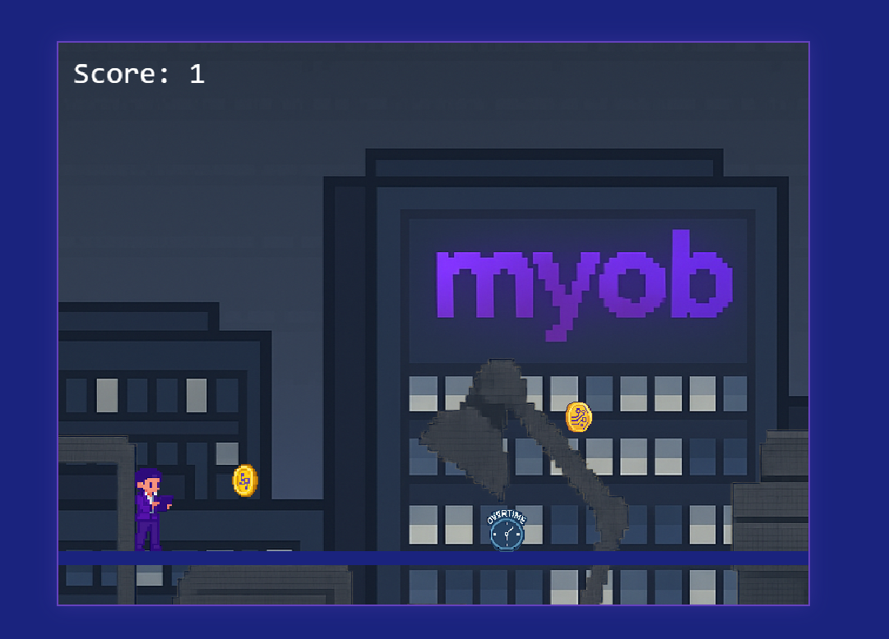

# Skedaddle

A runner game where you dodge obstacles and collect coins while racing against increasing difficulty.

<div align="center">
  
</div>

## Game Features

### Core Mechanics
- Variable jump height - hold space to jump higher
- Avoid the clock obstacles that fly in from the right and land on the path
- Collect coins to increase your score
- Powerups activate every 10 points
- Dynamic difficulty scaling

### Controls
- **Space/Up Arrow**: Jump (hold longer to jump higher)
- **Right Arrow**: Move forward and increase game speed
- **Mouse**: Click buttons for menu interactions
- **RESET button**: Reset the game during play

### Visual Style
- Pixel art rendering for crisp, retro-style graphics
- Smooth parallax scrolling backgrounds
- Visual cues and effects for game events

### Obstacle System
- Clock obstacles appear from the right side
- Randomized spawning with minimum distance between obstacles
- Obstacles sit directly on the path

### Powerup System
- Triggers at every 10 points
- Lasts 10 seconds
- Increases character size by 1.5x
- Allows destroying obstacles during powerup state
- Obstacles explode with spinning animation when destroyed

### Difficulty Scaling
The game becomes progressively harder over time:

#### Time-based Progression
- Difficulty increases every 15 seconds
- Maximum of 5 difficulty increases (1m15s total scaling)
- Visual "Speed Up!" indicator when difficulty increases

#### Speed Scaling
Initial speeds:
- Obstacle Speed: -300
- Coin Speed: -250

Each difficulty increase:
- All speeds increase by 10%
- Spawn intervals decrease by 10%

Difficulty progression example:
```
Start:
- Obstacle Speed: -300
- Coin Speed: -250
- Spawn Time: 2000-4000ms

After 15s (1st increase):
- Obstacle Speed: -330
- Coin Speed: -275
- Spawn Time: 1800-3600ms

After 30s (2nd increase):
- Obstacle Speed: -363
- Coin Speed: -302.5
- Spawn Time: 1620-3240ms

Final Stage (after 1m15s):
- Obstacle Speed: -483
- Coin Speed: -402.5
- Spawn Time: 1180-2360ms
```

## Getting Started

> **Important Note**: Due to browser security restrictions (CORS), this game cannot be run by simply opening the HTML file directly in a browser. You must use a local web server to run the game properly.

### Prerequisites
- Modern web browser with JavaScript enabled (Chrome, Firefox, or Edge recommended)
- One of the following:
  - Python (for automatic server setup)
  - Node.js (for automatic server setup)
  - Live Server extension for VS Code
- Minimal dependencies - the game only relies on the Phaser 3 library with no other external dependencies

## Installation Options

### Option 1: Download ZIP File
1. Go to the GitHub repository: https://github.com/yourusername/skedaddle
2. Click the green "Code" button near the top right of the page
3. Select "Download ZIP" from the dropdown menu
4. Once downloaded, extract the zip file to a folder on your computer
5. Follow the "Running the Game" instructions below

### Option 2: Clone from GitHub
1. Clone the repository
```bash
git clone https://github.com/yourusername/skedaddle.git
```
2. Navigate to the project directory
```bash
cd skedaddle
```
3. Follow the "Running the Game" instructions below

## Running the Game

Choose one of these methods to run the game:

### Method 1: Using start scripts (easiest)

**On Windows:**
- Double-click the `start-game.bat` file

**On macOS/Linux:**
- Open Terminal in the game directory
- Run: `chmod +x start-game.sh` (first time only)
- Run: `./start-game.sh`

**Using npm (all platforms):**
- Open a terminal/command prompt in the game directory
- Run: `npm start`

A local server will start automatically and your browser will open to http://localhost:8000

### Method 2: Using VS Code Live Server
1. Open the project in Visual Studio Code
2. Install the "Live Server" extension if you haven't already
3. Right-click on `index.html` and select "Open with Live Server"

### Method 3: Manual Server Setup
If you prefer to start a server manually:

1. Navigate to the project directory in terminal/command prompt

2. Start a local server:

With Python:
```bash
# Python 3
python3 -m http.server 8000

# Python 2
python -m SimpleHTTPServer 8000
```

With Node.js:
```bash
npx http-server -p 8000 --cors
```

3. Open your browser and navigate to: http://localhost:8000

### Troubleshooting

#### Port Already in Use
If you get an error like "Error: listen EADDRINUSE: address already in use 0.0.0.0:8000", try using a different port:

```bash
# Using npm
npm start -- -p 8080

# Using http-server directly
npx http-server -p 8080 --cors

# Using Python 3
python3 -m http.server 8080
```

Then access the game at http://localhost:8080 instead.

#### Cross-Browser Testing
The game has been tested on Chrome, Firefox, and Edge. If you encounter any browser-specific issues:
- Make sure your browser is up to date
- Try a different browser
- Check browser console for errors (F12 to open developer tools)

## Why a Server is Required

This game uses ES6 modules and loads assets (images, sprites) that browsers won't allow to be loaded from local files (`file://` URLs) due to security policies. These Cross-Origin Resource Sharing (CORS) restrictions prevent the game from working when directly opening the HTML file.

## Development

### Asset Structure
```
assets/
  ├── background/     # Parallax backgrounds
  ├── character/      # Character animations
  ├── coins/         # Coin sprites and effects
  ├── obstacles/     # Game obstacles
  └── powerups/      # Powerup effects
```

### Key Files
- `index.html`: Main game file
- `js/scenes/`: Game scene files
  - `BootScene.js`: Asset loading
  - `MenuScene.js`: Main menu
  - `GameScene.js`: Core gameplay
  - `GameOverScene.js`: Game over screen
- `js/config/`: Configuration files
  - `gameConstants.js`: Game parameters and settings
  - `config.js`: Phaser configuration

## Contributing

Please read [CONTRIBUTING.md](CONTRIBUTING.md) for details on our code of conduct and the process for submitting pull requests.

## License

All Rights Reserved - this game is not licensed for redistribution. 